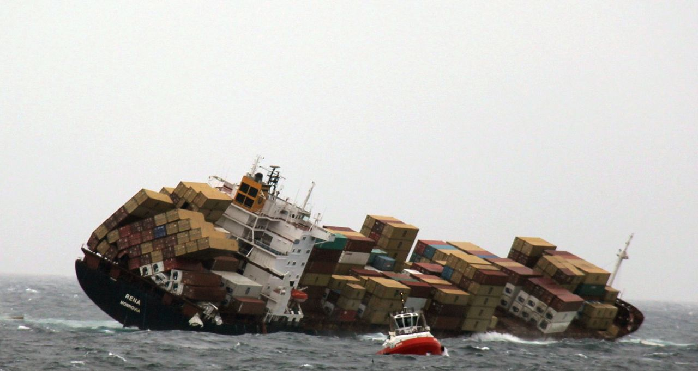

# Contruindo sua propria imagem com Dockerfile

# Dockerfile?!
Esse arquivo maroto descreve de forma bem clara os passos necessarios para montar uma determinada Imagem.
Ele não é nada mais que um arquivo de texto, com algumas instruções (usando palavras-chave), que o Docker sabe ler e a partir disso montar uma imagem para você.


### Exemplo de conteúdo de um Dockerfile:
```Dockerfile
FROM ubuntu:14.04

RUN apt-get update

# deps do nosso projeto web em python
ADD arquivo_local.txt /tmp/arquivo_copiado.txt

EXPOSE 8000 4444 1234
```


# Palavras-Chave
A seguir algumas palavras-chave e como usa-las:

## FROM
Esta deve ser a primeira instrução num Dockerfile, ela serve pra definir que imagem será usada como base para esse container, existem diversas imagens
Exemplo:
```Dockerfile
FROM nome_da_imagem:alguma_tag
```

Sendo que não é necessário dizer qual a tag(versão da imagem), nesse caso ele vai pegar a ultima gerada, chamada de `latest`:

```Dockerfile
FROM nome_da_imagem
```

## RUN
A que você provavelmente vai usar mais vezes. Tudo que vem depois de `RUN` vai ser executado pelo docker pra contruir a imagem.

Dessa forma, se você quer uma imagem de um Ubuntu:12.04, que tenha uma pasta com nome de `ola` na raiz(`/`), e um arquivo `mundo` dentro dessa mesma pasta, você precisa apenas fazer:

```Dockerfile
FROM ubuntu:12.04

RUN mkdir /ola

RUN touch /ola/mundo
```


## ADD
Adiciona arquivos ou pastas locais para a imagem que vai ser gerada.

Por exemplo, caso queira copiar os conteudos da pasta `meus_scripts` (considerando que ela esta no mesmo diretorio que seu Dockerfile) para que fiquem dentro da pasta `/home/scripts` dentro da imagem, basta fazer:
```Dockerfile
ADD meus_scripts /home/scripts/
```

## EXPOSE

Diz pro docker quais portas ficaram expostas quando um container for criado usando essa imagem.
Um container do banco de dados PostgreSQL rodando na porta `5432`, deveria então expor essa porta, para que ela possa ser acessada de fora do container.


# O que devo por no meu Dockerfile?

Depende do que você quer ele tenha. Esse é um processo que normalmente exige um pouco de tentativa e erro, ou bastante pesquisa (algumas vezes você acha exemplos na internet em que alguem já fez um Dockerfile com o que você quer).


## Filosofia Docker
Tente na medida do possível, por uma aplicação rodando em cada container.
Exemplo:
Um container para aplicação web, um para o BD, outro para o serviço de cache, etc...




# Construindo a imagem
Uma vez terminado seu `Dockerfile` execute o comando: `docker build -t <nome_da_imagem> .` na pasta onde ele está.

Com isso o Docker vai ler o arquivo, e montar uma nova imagem usando as instruções que você descreveu no seu Dockerfile.


[Rodando um container](rodando_container.md)
