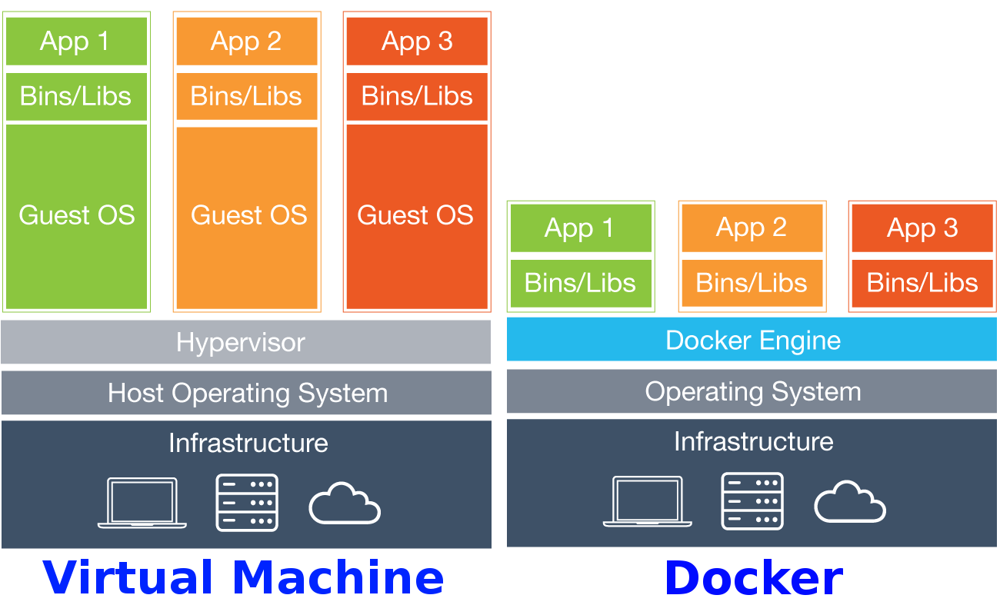

# O que é Docker?
Tipo uma vm, só que melhor.

## Container Vs VM

## Nomeclaturas:
Alguns nomes para não se perder nessa jornada.

### Docker Host

*Algumas vezes chamado apenas de Host (quando se esta falando no contexto do Docker).*

Máquina que está rodando os containers (normalmente será a sua máquina).

### Imagem

Fazendo uma analogia com Orientação a Objectos, Imagem seria a **classe**.
É ela que detem o estado inicial do que vai ser rodado pelo docker.

### Container

Na mesma analogia, um Container é uma **instância** de uma classe.
Portanto quando vc coloca alguma aplicação para rodar no Docker, você está usando uma **IMAGEM** como base para instânciar um novo **CONTAINER** que vai rodar sua aplicação.

Portanto nunca se roda uma imagem, apenas um container, pois ele é a instancia de uma imagem rodando com algum programa.

[Contruindo sua pripria imagem com Dockerfile](construindo_imagem.md)